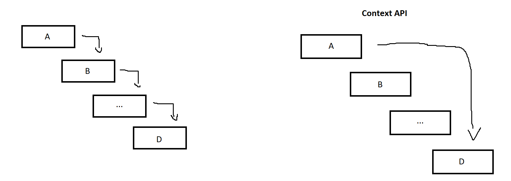

M passamos as informações para os componentes filhos via props.
Passagem por props é uma ótima maneira de canalizar dados explicitamente por meio de sua árvore de interface do usuário para os componentes que os utilizam
Mas isso pode tornar nosso código muito verboso e incoveniente se você tiver que passar as informações para diferentes componentes filhos.
O ancestral comum mais próximo pode estar muito longe dos componentes que precisam de dados, e elevar o estado tão alto pode levar a uma situação chamada “Prop drilling”.

# Questão 04

## O que é PROPS DRILLING?

- Algumas vezes, quando queremos passar informações para os componentes filhos, passamos por meio das `props`. Isso é incoveniente se tivermos muitos componentes filhos, pois o acenstral comum mais próximo pode está muito longe.
- Esse problema é o chamado PROPS DRILLING.

## Como o uso de contextos pode resolver essa situação?  

- O uso de contexto permite que um componente pai forneça dados para a árvore de filhos logo abaixo dele (mesmo que o pai esteje distante).  
- Dessa forma, os dados são passados para apenas os filhos que desejam consumir essas informações.  
- Veja a imagem abaixo que ilustra o Props Drilling (a esquerda) e o uso de contextos (a direita):
  - Aqui desejamos passar dados do componente A para o componente D.
  - Por props, temos que passar esses dados por todos componentes na árvore entre A e D, o que pode ser um problema caso exista um número enorme de componentes intermediários (Props Driling).
  - Usando contextos isso não é preciso, uma vez que o componente D tem acesso aos dados do seu componente pai A.  

    

